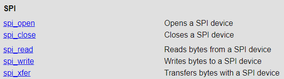
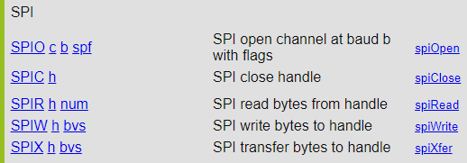
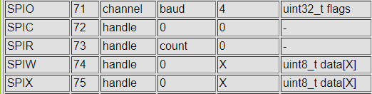

This is a guide on adding Pigpio functions to SplashKit. In this guide we will go over how to add the SPI protocol function. SplashKit will need both a local and a remote version of this function.

### Local
For local operations we use the pigpiod C interface, `pigpiod_if2`. The list of functions that are avilable in this interface are described [here](https://abyz.me.uk/rpi/pigpio/pdif2.html). Scroll down the list of functions and there will be a section titled 'SPI'.


For a basic implementation, we really only need to implement `spi_open`, `spi_close` and `spi_write`.

#### [`spi_open`](https://abyz.me.uk/rpi/pigpio/pdif2.html#spi_open)

The signature for this function is:
```
int spi_open(int pi, unsigned spi_channel, unsigned baud, unsigned spi_flags)
```

`pi` is a handle to the specific raspberry pi board, and for local functions this is stored in SplashKit in the `pi` variable, so we only we don't need to provide this in the function call.

We'll need 2 functions to support this, a backend function with the `sk_` prefix in `gpio_driver` and a 'frontend' function with the `raspi_` prefix in `raspi_gpio`

`gpio_driver.cpp`
```
    int sk_spi_open(int channel, int speed, int spi_flags)
    {
        return spi_open(pi, channel, speed, spi_flags);
    }
```

`raspi_gpio.cpp`
```
	int raspi_spi_open(int channel, int speed, int spi_flags)
    {
#ifdef RASPBERRY_PI
        int handle = -1;
		handle = sk_spi_open(channel, speed, spi_flags);
        return handle;
#else
        cout << "Unable to open SPI interface - GPIO not supported on this platform" << endl;
#endif
    }
```

We'll need also need to add these functions to the appropriate header files.

#### [`spi_close`](https://abyz.me.uk/rpi/pigpio/pdif2.html#spi_close)
The signature for this function is: `int spi_close(int pi, unsigned handle)`
Which we'll then implement in the SplashKit code:

`gpio_driver.cpp`
```
    int sk_spi_close(int handle)
    {
        return spi_close(pi, handle);
    }
```
`raspi_gpio.cpp`
```
    int raspi_spi_close(int handle)
    {
#ifdef RASPBERRY_PI
        return sk_spi_close(handle);
#else
        cout << "Unable to close SPI interface - GPIO not supported on this platform" << endl;
#endif
    }
```

#### [`spi_xfer`](https://abyz.me.uk/rpi/pigpio/pdif2.html#spi_xfer)

This function is a little more complex: `int spi_xfer(int pi, unsigned handle, char *txBuf, char *rxBuf, unsigned count)`

When we transfer data we need buffers to store the data we are going to send, and to store the data that we receive. We'll also need to let the function know the size of the buffer, and this is represented by the count variable.

`gpio_driver.cpp`
```
    int sk_spi_transfer(int handle, char *sendBuf, char *recvBuf, int count)
    {
        return spi_xfer(pi, handle, sendBuf, recvBuf, count);
    }	
```
`raspi_gpio.cpp`
```
    int raspi_spi_transfer(int handle, char *sendBuf, char *recvBuf, int count)
    {
#ifdef RASPBERRY_PI
        return sk_spi_transfer(handle, sendBuf, recvBuf, count);
#else
        cout << "Unable to transfer through SPI - GPIO not supported on this platform" << endl;
#endif
    }
```

### Remote

For remote operations, pigpio uses a socket interface. More information can be found [here.](https://abyz.me.uk/rpi/pigpio/sif.html)

It expects messages of the following type:
```
typedef struct  
{  
    uint32_t cmd;  
    uint32_t p1;  
    uint32_t p2;  
    union  
    {  
        uint32_t p3;  
        uint32_t ext_len;  
        uint32_t res;  
    };  
} cmdCmd_t;
```
SplashKits version of this is `sk_pigpio_cmd_t` and is found in `splashkit-core/coresdk/src/backend/backend_types.h`. It looks like:
```
typedef struct
{
	uint32_t cmd_code = -1; 
	uint32_t param1 = -1;
	uint32_t param2 = -1;
	union
	{
		uint32_t param3;
		uint32_t ext_len;
		uint32_t result;
	};
} sk_pigpio_cmd_t;
```

Okay so we want to implement remote versions of `spi_open`, `spi_close`, and `spi_xfer`. One the information page linked above there is a large table detailing each command and what the command expects to be contained in each field of the command struct. The names of each command does not match up well with what's found in `pigpiod_if2`. 

This is because the command works off the `pigs` utility -- effectivcely a command line tool to ineract with the pigpio daemon. Information on `pigs` commands can be found [here.](https://abyz.me.uk/rpi/pigpio/pigs.html)
If we scroll down the provided information regarding pigs and its commands, we'll find the following section on SPI:

Okay! So we just need to implement commands for `SPIO`, `SPIC`, and `SPIX`. Lets go back to the [socket interface information](https://abyz.me.uk/rpi/pigpio/sif.html) and find these commands in the 'request' table. Scrolling down we'll find this section:


So we can see from this table we need to do the following to send these commands:

| Function | cmd_code | param1  | param2 | param3 | ext             |
| -------- | -------- | ------- | ------ | ------ | --------------- |
| SPIO     | 71       | channel | baud   | 4      | uint32_t flags  |
| SPIC     | 72       | handle  | 0      | 0      | -               |
| SPIX     | 75       | handle  | 0      | X      | uint8_t data[X] |

We can transform these into the following: